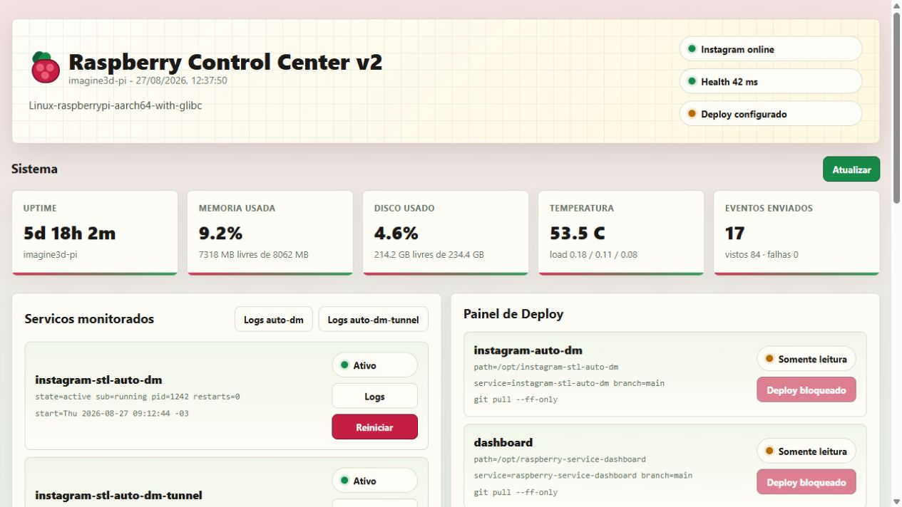

# Raspberry Service Dashboard

Portfolio-ready FastAPI control center for a Raspberry Pi or small Linux server. It monitors system health, service status, safe logs, deploy targets, notification channels, and host inventory from one lightweight web UI.



This repository is the public, sanitized version of a real Raspberry deployment. It is designed to show the engineering approach without publishing private domains, tokens, service names, IPs, or deployment secrets.

## What It Shows

- Raspberry Control Center v2 with a responsive Raspberry-themed dashboard.
- `/api/status` for uptime, memory, disk, temperature, load average, services, deploys, and notifications.
- `/api/inventory` for public-safe host inventory: model, IPs, mounts, monitored services, and installed tools.
- `/api/logs/{service}` with token redaction before logs reach the browser.
- Optional `/api/services/{service}/restart` for allowlisted systemd services.
- Optional `/api/deploys/{target}/run` for allowlisted deploy targets.
- Optional notification test endpoint for webhook-based alerting.
- Tests for service allowlisting, log redaction, deploy safety, and inventory output.

## Public vs Private

This repo is intentionally public. It contains reusable code, example configuration, tests, documentation, and architecture notes.

Private operational details belong in a separate private overlay repo:

- `.env` files and real service names.
- Personal domains, local IPs, SSH hosts, and tunnel URLs.
- Real deploy targets and commands.
- API tokens, webhook URLs, passwords, and app secrets.
- Screenshots with sensitive data.

See [docs/public-private-strategy.md](docs/public-private-strategy.md) for the recommended two-repo workflow.

## Architecture

The app is split into small modules so each responsibility is easy to review:

```text
raspberry_dashboard/
  app.py            FastAPI routes and response composition
  metrics.py        uptime, memory, disk, load and temperature
  services.py       systemd status and allowlisted restarts
  logs.py           journalctl reader with redaction
  deploys.py        allowlisted deploy targets
  notifications.py  webhook notification status and test
  inventory.py      public-safe Raspberry inventory
  health.py         HTTP health checks and tunnel discovery
  config.py         environment-driven configuration
  ui.py             single-file dashboard UI
```

More detail is in [docs/architecture.md](docs/architecture.md).

## Setup

```bash
python -m venv .venv
source .venv/bin/activate
python -m pip install -r requirements.txt
python -m uvicorn raspberry_dashboard.app:app --reload
```

On Windows PowerShell:

```powershell
python -m venv .venv
.venv\Scripts\Activate.ps1
python -m pip install -r requirements.txt
python -m uvicorn raspberry_dashboard.app:app --reload
```

Open `http://127.0.0.1:8000`.

For a portfolio-safe demo screen:

```bash
DEMO_MODE=true python -m uvicorn raspberry_dashboard.app:app --reload
```

## Configuration

Start from `.env.example`:

```bash
cp .env.example .env
```

Common variables:

```bash
MONITORED_SERVICES=instagram-stl-auto-dm,instagram-stl-auto-dm-tunnel
RESTARTABLE_SERVICES=instagram-stl-auto-dm,instagram-stl-auto-dm-tunnel
INSTAGRAM_HEALTH_URL=http://127.0.0.1:8000/health
DEPLOY_ACTIONS_ENABLED=false
NOTIFICATION_TEST_ENABLED=false
DEMO_MODE=false
```

Deploy targets use JSON so real project paths can stay in a private overlay:

```json
[
  {
    "name": "instagram-auto-dm",
    "path": "/opt/instagram-stl-auto-dm",
    "service": "instagram-stl-auto-dm",
    "branch": "main",
    "command": ["git", "pull", "--ff-only"]
  }
]
```

## Safety Defaults

- Unknown services return `404`.
- Non-allowlisted restart attempts return `403`.
- Deploy actions are disabled unless `DEPLOY_ACTIONS_ENABLED=true`.
- Notification test is disabled unless `NOTIFICATION_TEST_ENABLED=true`.
- Logs are redacted for common token, secret, API key, bearer token, and Instagram token patterns.
- The public repo ships examples only; real `.env` and operational config are ignored.

See [docs/security-model.md](docs/security-model.md).

## Deploy on Raspberry Pi

Copy the project to `/opt/raspberry-service-dashboard`, create a virtual environment, install requirements, and adapt:

```text
deploy/raspberry-service-dashboard.service
```

The systemd unit reads private configuration from:

```text
/etc/raspberry-service-dashboard/dashboard.env
```

Install:

```bash
sudo cp deploy/raspberry-service-dashboard.service /etc/systemd/system/
sudo systemctl daemon-reload
sudo systemctl enable --now raspberry-service-dashboard
```

## Portfolio Angle

This project is useful in a portfolio because it demonstrates:

- Backend API design with FastAPI.
- Linux/systemd integration.
- Secure operational actions through explicit allowlists.
- Log redaction before browser exposure.
- Environment-based deployment separation.
- Tests for safety boundaries.
- Documentation that separates public demo code from private production use.
